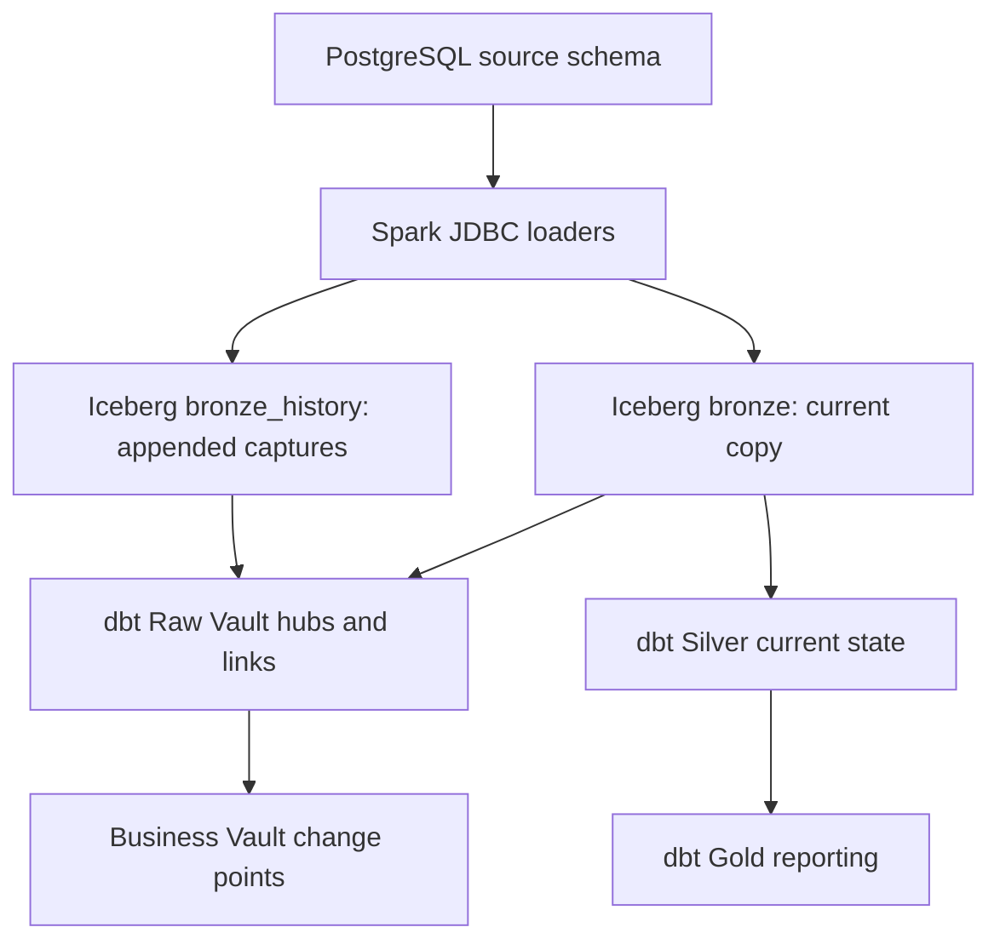
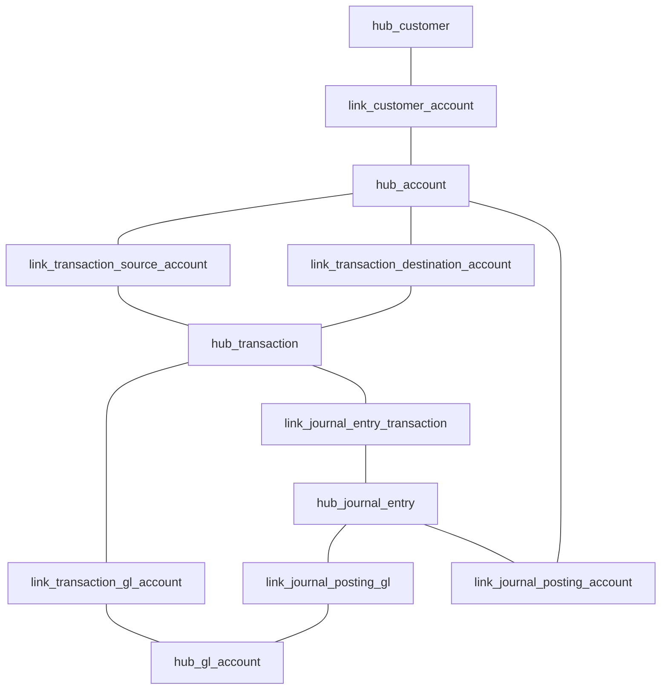

# Iceberg Core Banking Lab

Local core banking data lab using PostgreSQL, Spark, Apache Iceberg and dbt.

## Data flow

PostgreSQL source tables → Spark JDBC load → Iceberg bronze/history tables → dbt silver, Raw Vault, Business Vault and gold models.

The Business Vault PIT models retain customer and account change points. The account example records ACTIVE → INACTIVE.

## Local prerequisites

- Docker Desktop and Docker Compose
- An existing PostgreSQL service reachable as `postgres` on the external Docker network `airflow_default`
- PostgreSQL JDBC driver `postgresql-42.7.13.jar` in `jars/`
- Local environment variables `PGHOST`, `PGPORT`, `PGDATABASE`, `PGUSER` and `PGPASSWORD` for the Python loaders

The `warehouse/` data, JDBC jar, local dbt `profiles.yml`, and notebook outputs are excluded from Git. Copy `dbt_project/profiles.example.yml` to `dbt_project/profiles.yml` and set the local Spark Thrift host and user before running dbt.

## Validation

`dbt build` completed with 28 PASS, 0 WARN and 0 ERROR on 2026-09-27. A manual Airflow run on the same date completed all six tasks successfully in about 25 minutes.

## Architecture and source history

`load_bronze.py` replaces six current Bronze tables. `load_bronze_history.py` appends a full capture of those six sources with `_snapshot_id` and `_snapshot_at`. This source-capture history is distinct from Iceberg's own table snapshots. The lab's Iceberg catalog uses the local `./warehouse` directory.

## Data Vault model

Hubs hold stable business keys: customer ID, account ID, transaction ID, GL account code, and journal entry ID. Links hold relationships; Satellites hold descriptive attributes and their changes. The model hashes business keys with SHA-256 and compares Satellite `hashdiff` values across captures.

The source and destination Links express the two Account roles in a transaction. The journal posting Links include `posting_id` in their relationship keys. `sat_journal_posting_amount` attaches to `link_journal_posting_gl` and records debit and credit amounts; this model has no separate posting Hub.

| Hub | Descriptive Satellite | Relationships |
| --- | --- | --- |
| `hub_customer` | `sat_customer_details` | Customer–Account |
| `hub_account` | `sat_account_details` | Customer–Account, transaction source/destination, posting account |
| `hub_transaction` | `sat_transaction_details` | Source/destination Account, GL Account, Journal Entry |
| `hub_gl_account` | `sat_gl_account_details` | Transaction–GL, posting GL |
| `hub_journal_entry` | `sat_journal_entry_details` | Journal Entry–Transaction, posting Account/GL |

`sts_customer_account` records changes in whether a Customer–Account relationship appears in each source capture. `pit_customer` and `pit_account` point to the latest relevant Satellite row and retain only the initial point and subsequent pointer changes. They are **change-point tables**: an as-of lookup selects the most recent PIT row where `snapshot_at <= requested_time`. The tested `A001` account changes from `ACTIVE` to `INACTIVE` at its second PIT point; unchanged later captures produce no additional PIT rows.

## File guide

| Path | Role |
| --- | --- |
| `seed_data.py` | Creates and seeds synthetic core banking source data in PostgreSQL. |
| `read_source.py` | Checks Spark JDBC access to source transactions. |
| `load_bronze.py` | Replaces current Iceberg Bronze tables from PostgreSQL. |
| `load_bronze_history.py` | Appends source captures to six Iceberg history tables. |
| `compose.yaml` | Starts Spark/Jupyter and dbt using the external `airflow_default` network. |
| `spark-defaults.conf` | Configures Spark's Iceberg catalog and warehouse. |
| `dbt-image/Dockerfile` | Builds the dbt container. |
| `dags/core_banking_iceberg_pipeline.py` | Manual Airflow orchestration for the Iceberg pipeline. |
| `infra/airflow-compose.example.yml` | Sanitized reference for the separate Airflow/PostgreSQL stack. |
| `dbt_project/dbt_project.yml` | Sets dbt project configuration. |
| `dbt_project/profiles.example.yml` | Template for the local Spark Thrift connection. |
| `models/bronze/sources.yml` | Declares the current Bronze dbt sources. |
| `models/raw_vault/bronze_history_sources.yml` | Declares the captured-history dbt sources. |
| `models/raw_vault/hub_*.sql` | Five business-key Hubs. |
| `models/raw_vault/link_*.sql` | Seven relationship Links. |
| `models/raw_vault/sat_*.sql` | Six attribute Satellites, including posting amounts. |
| `models/raw_vault/sts_customer_account.sql` | Customer–Account relationship status changes. |
| `models/business_vault/pit_*.sql` | Customer and Account Satellite change points. |
| `models/silver/silver_*.sql` | Current-state Customers, Accounts, Transactions, and GL Accounts. |
| `models/gold/gold_*.sql` | Account summary, daily customer transactions, and top customers. |
| `dbt_project/macros/generate_schema_name.sql` | Controls generated dbt schema names. |

Paths beginning with `models/` above are relative to `dbt_project/`. The Gold models read current Silver tables; they do not reconstruct historical views from the Vault. The Vault and PIT models provide a separate basis for historical/as-of analysis.

## Reproduction notes

This repository records a working local lab; it is not a one-command deployment. It expects a PostgreSQL service called `postgres` on `airflow_default` and `postgresql-42.7.13.jar` in the ignored `jars/` directory. The loaders read `PGUSER` and `PGPASSWORD` from their runtime environment. Copy `profiles.example.yml` to the ignored `profiles.yml` and fill in the local Spark Thrift host and user. The exploratory notebook, local Iceberg warehouse, JDBC jar, credentials, and generated dbt files are intentionally excluded from Git.

## Airflow orchestration

`dags/core_banking_iceberg_pipeline.py` is the manually triggered DAG tested in the local lab. It runs current Bronze → Silver → Gold → append Bronze history → Raw Vault → Business Vault. It uses the Airflow connection `iceberg_source_postgres` and executes commands in the existing `spark-iceberg` and `dbt-iceberg` containers via Docker CLI. The Spark container must contain the two loader scripts at `/home/iceberg/`, and Airflow must have Docker CLI and access to the same Docker daemon. The DAG disables task retries because re-running the history loader creates another source capture; manual triggering also creates a new capture. The dbt tasks use `dbt run`, while the separately reported validation used `dbt build`.

`infra/airflow-compose.example.yml` documents the separate Airflow/PostgreSQL stack used by this lab. It is an example, not a replacement for an existing deployment or its persistent volume. Supply a local, ignored `.env` with credentials before using it, and configure Docker CLI access for Airflow separately. The current `compose.yaml` still expects the external `airflow_default` network.
